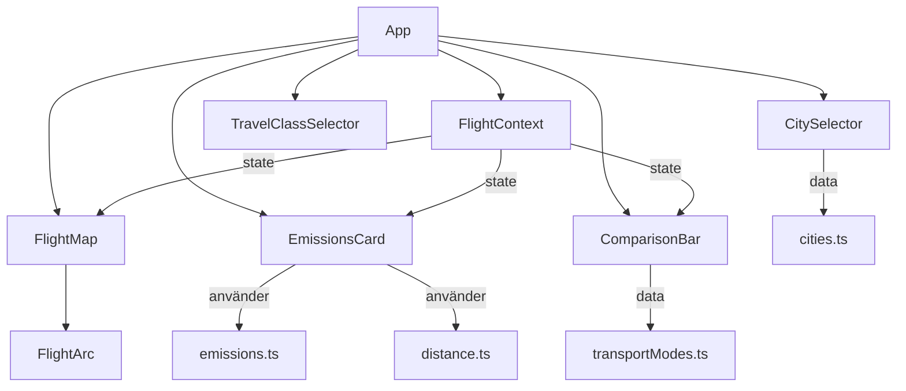
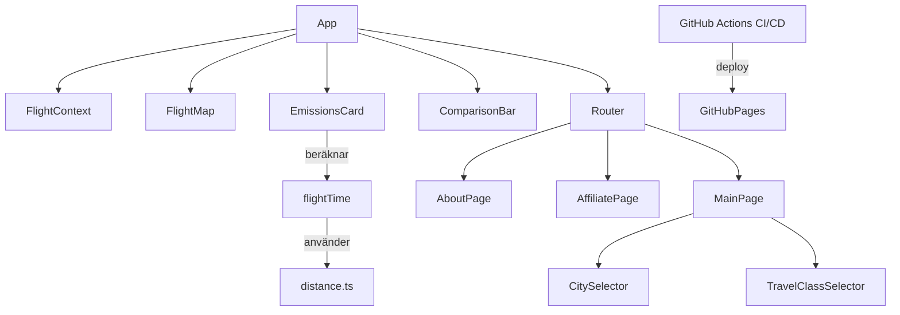
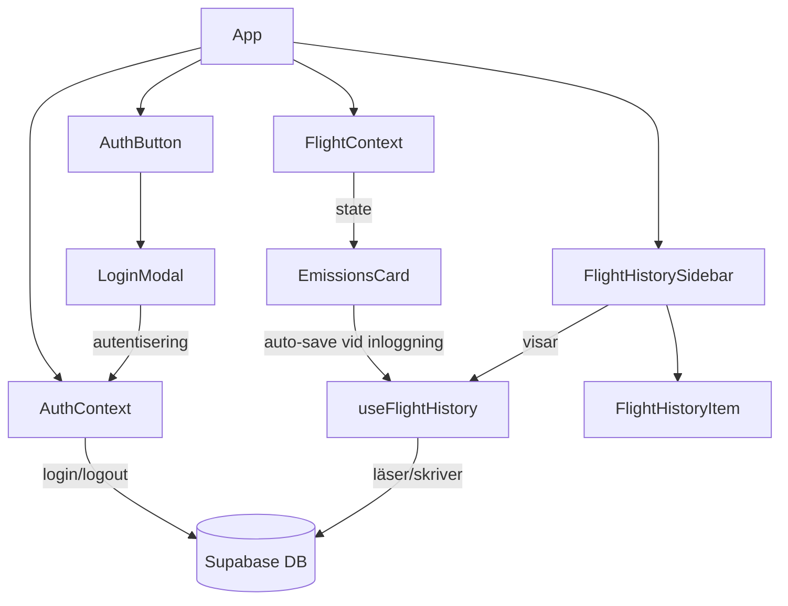
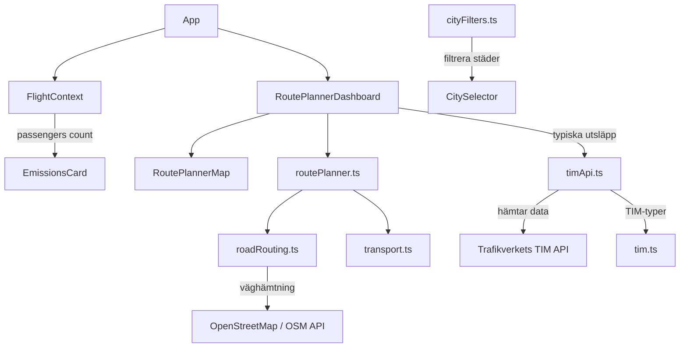
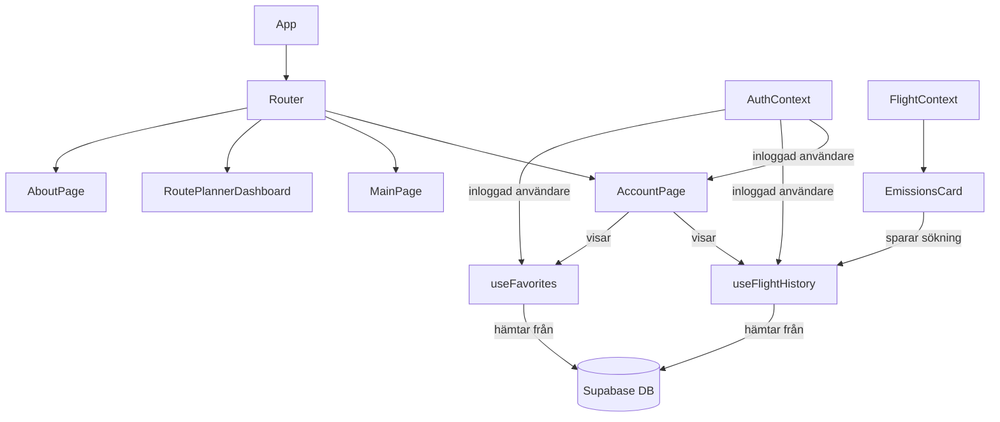

# UML Diagrams – Weekly Snapshots

## Vecka 1 — MVP (2026-04-20)

Grundstrukturen: karta, utsläppsberäkning, städer och reselägen.

---

## Vecka 2 — Deployment + Sidor (2026-04-22–24)

Lade till GitHub Pages-deploy, flygtid och nya sidor.

---

## Vecka 3 — Auth + Supabase + Historik (2026-04-25–27)

Inloggning via Supabase, sparande av flyghistorik.

---

## Vecka 4 — Bilreseplanner + TIM API + Gruppresor (2026-04-28–05-04)

Lade till bilrutt, extern transport-API och stöd för flera passagerare.

---

## Vecka 5 — Konto + Sökhistorik + Favoriter (2026-05-05–11)

Kontosida med sökhistorik och favoriter.

